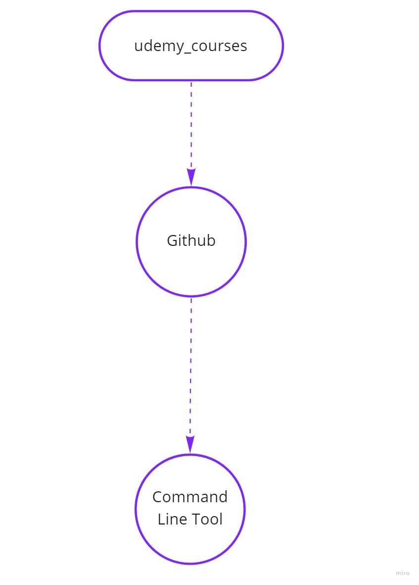
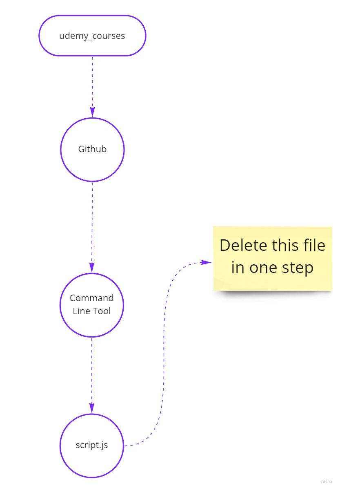
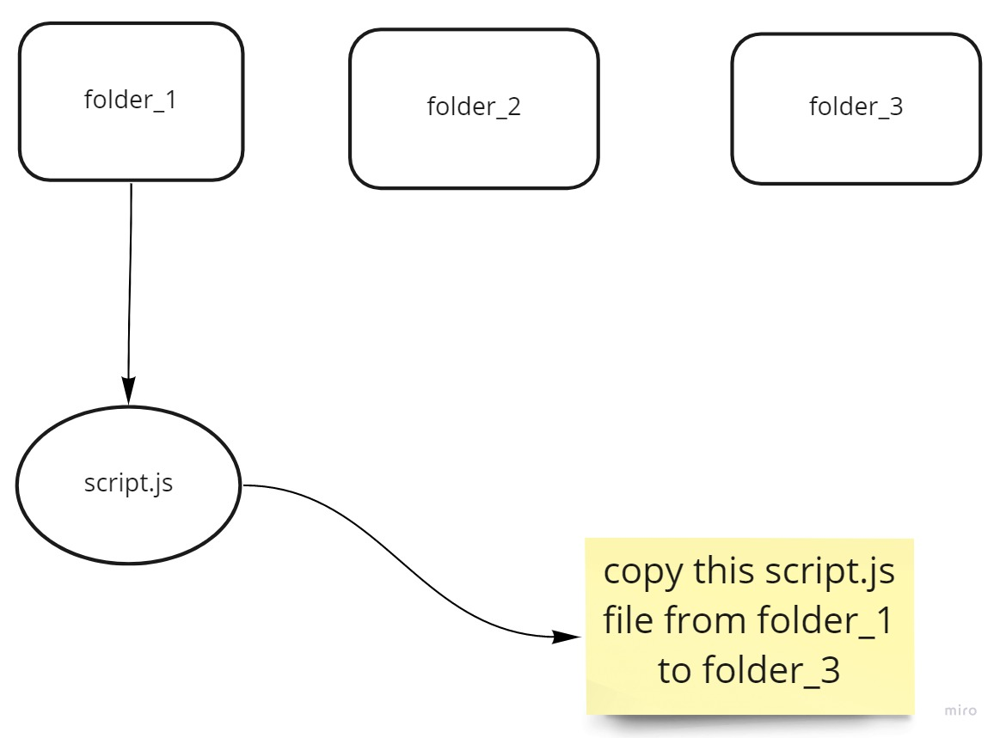
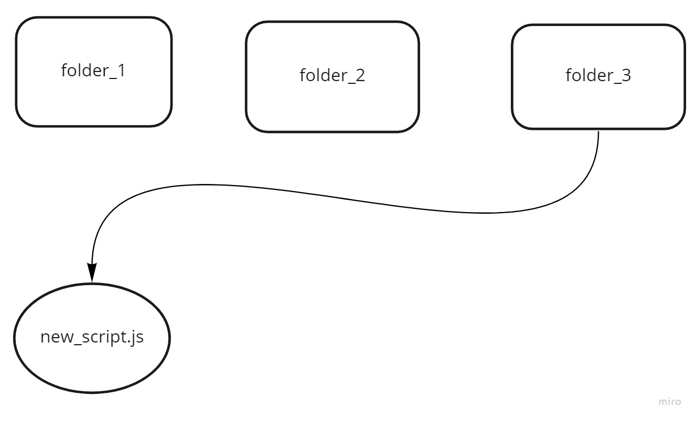

# Git Github Master Course

0. Course Curriculum:

    - Version control system
    - Command line tool
    - Git intro
    - tracking a project
    - git additional commands
    - branching
    - merging
    - rebasing
    - Intro to Github
    - Social coding with Github
    - Rewriting History

1. Version Control System:

    - It is basically a management software for managing changes.

    - Easy recovery of files/folder

    - Rollback to the previous versions.

    - Informs us about who, what, when, why changes have been made.

    - What is a repository ?

    - Types of VCS:

        1. Local VCS
        2. Centralized VCS
        3. Distributed VCS
    
    - Disadvantages of Local VCS ?

    - Disadvantages of centralized VCS ?

    - Disadvantages of Distributed VCS ?

    - What is a working copy in centralized VCS ?

    - commit means to makes changes.

    - commit vs update in centralized VCS ?

    - Github is a distributed VCS ?

    - Advantages of dsitributed VCS ?

    - Local and Central repositories in distributed VCS ?

    - commit vs update in distributes VCS ?

    - What is git ?

    - git stores snapshop of your project (not differences).

    - Snapshots of project over time.

    - Rollback to the previous version of the project.

    - Why git ?

    - git Features ?

    - "distributed" actually means different users will have their own repository known as local repository.

    - Non-linear/branching (most important git feature)

    - By creating branches, you are not destroying the actual website, everyone is looking at the whole website, but you can create new branches and can work side by side on the new features as well.

    - git uses "hashing" for each each commit or each changes. 

    - git uses "MD5 Algorithm". 

    - git is written in language C.

    - 

2. Setting Up the Environment: (git bash commands)

    - To check the git version:

        - git --version

    - To check folder directory:

        - pwd
    
    - To move to a directory:

        - cd Desktop
    
    - To view all files in a directory:

        - ls
    
    - Configure git:

        - Configuration of global variables:

            - git config --global user.name "Kapil Chaudhary"
            - git config --global user.email "chaudharikapil16@gmail.com"
        
        - We need to tell git that whenever we make changes then save this with this name and email.
    
    - Check/See the configuration:

        - git config --list
    
    - Clear the git bash:

        - clear

3. Command Line Tool:

    - MacOS and Linux --> terminal

    - Windows --> git bash

    - what is a "root" directory ? --> directory at the top most level.

    - Commands:
    
        - print working directory:
        
            --> pwd
        
        - List Items / List all the files and folder:

            --> ls
        
        - List all the folders and files in a list format i.e. there will be one item in one list:

            --> ls -l
        
        - Also show all the hidden files and folders:

            --> ls -a
        
        - Clear the command prompt or terminal:

            --> clear
        
        - Also show all the hidden files and folders in a list format i.e. there will be one item in one list:

            --> ls -al

        - Change Current Directory to go inside child directories i.e. "One Step downward":

            --> cd folder_name

        - Go back to the parent directory from a child directory i.e. "One step upward":

            --> cd ..
        
        - Go back to the top most current working directory from any child directory i.e. "Many Step Upward":

            --> cd

            or

            --> ~
        
        - Moving multiple directory downwards from the current working directory:

            --> cd Documents/College/DSA
        
        - Go to the root directory:

            --> cd /
        
        - Create a new folder or directory:

            --> mkdir new_folder_name

            --> e.g. mkdir udemy_courses
        
        - Create three different new folders at the same time:

            --> mkdir folder1 folder2 folder3

            --> e.g. mkdir udemy_course1 udemy_course2 udemy_course3

        - I want to create this folder hierarchy at the same time:

            --> mkdir -p udemy_courses/Github/Command_Line_Tool

        - Creating a new file:

            --> touch script.js

            --> touch index.html

            --> touch notes.txt
        
        - Remove Files and Folders:

            --> rm file_name

            --> e.g. rm script.js

            --> e.g. rm index.html

        - Delete this script.js file in one go:

            --> rm udemy_courses/Github/Command_Line_Tool/script.js
        
        - Remove  an empty folder/directory:

            --> rmdir folder_name

        - Remove a non-empty folder/directory:

            --> rmdir -R folder_name

            --> Here -R refers for recursively
        
        - Copy Files:

            -->  cp folder_1/script.js folder_3/new_script1.js

        - Copy a complete non-empty folder to the current working directory:

            --> cp -R folder_3 new_folder_3

        - Move/Cut a file:

            --> mv folder_1/script.js folder_3/new_script.js
        
        - Move/Cut a folder:

            --> mv -R folder_3 new_folder_3
        
        - Move/Cut the script.js file within the same working directory and save it with a new name called hello.js:

            --> mv script.js hello.js

        

